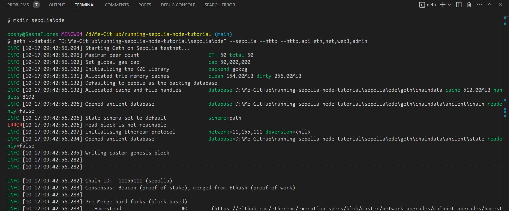
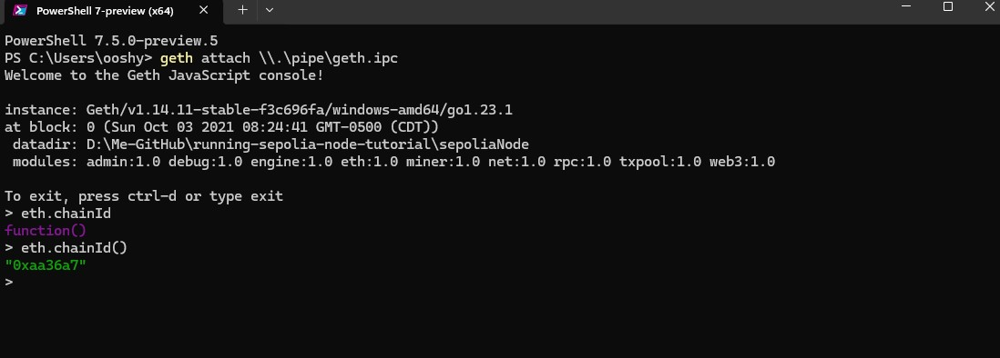
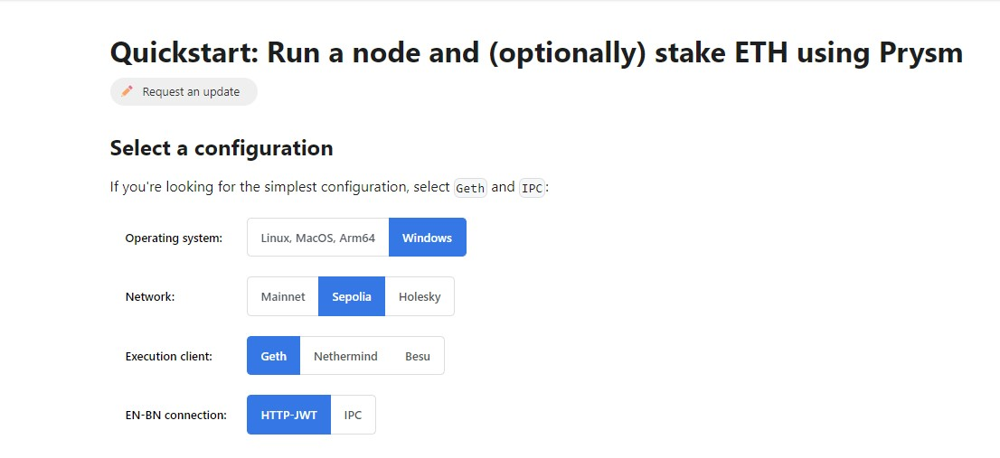
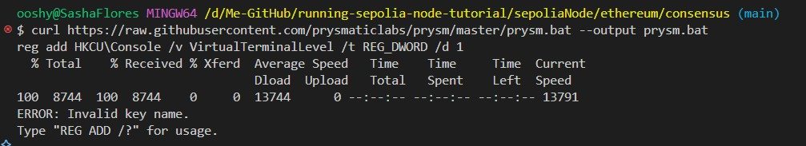
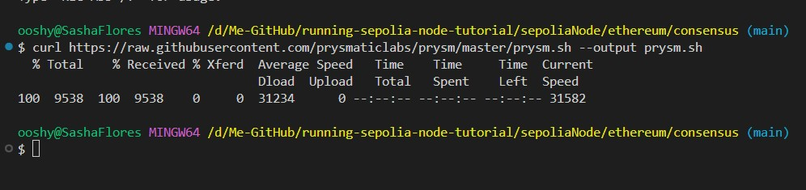

# running a sepolia node tutorial

This tutorial will guide you through the process of running a sepolia node on your local machine.

### Prerequisites:


- [Go-Ethereum](https://geth.ethereum.org/docs/install-and-build/installing-geth) installed on your machine Or downloaded on your machine with developer tools included [Go-Ethereum](https://geth.ethereum.org/downloads) . 
- [Prysm](https://docs.prylabs.network/docs/getting-started)


### Step 1: open your terminal

```bash
$ geth --version
```

-  You should see the version of geth if it is installed properly on your machine, you may run into an error `geth isn't recognized as an internal or external command` then you need to add the path to the geth executable to your system environment variables by opening the environment variables settings on your machine and adding the path to the geth executable to the PATH variable.


- If you running your terminal or bash in VSCode, you may need to restart the terminal or bash to see the changes take effect. Sometimes you may need to add
the path to the geth executable to the PATH variable in your `.bashrc` or `.bash_profile` file in your home directory by adding the following line to the `.bashrc` and most probably you will need to restart your terminal or bash to see the changes take effect you will have a `PATH` already existing so you can add the second line for example:

    - export PATH="$PATH:/c/Program Files/Geth" 
    - export PATH="$PATH:/c/Users/yourUserName/.foundry/bin:/c/Program Files/Geth"

- Your `.bash_profile` is already properly set up to source .bashrc, as it includes:

    - test -f ~/.profile && . ~/.profile
    - test -f ~/.bashrc && . ~/.bashrc

- If you're using powerShell and you run into same error, you need to look up where your profile exists by running
```bash
$profile
```

- Normally, it should exists in `C:/Users/YourUserName/Documents/PowerShell`
  then you should add the path to the geth executable to the PATH variable in your profile file by adding the following line to the profile file and most probably you will need to restart your terminal  see the changes take effect:

    - $env:Path += ";C:\Program Files\Geth"

### Step 2: Generate Accounts

It isn't a necessity to generate accounts but it's a good practice to generate accounts for your blockchain network. To generate accounts, run the following command:

```bash
geth --datadir "pathToDirectoryToSaveGeneratedKeys" account new
```
- `--data-dir` flag specifies the directory where the blockchain data will be stored.
- `"pathToDirectoryToSaveGeneratedKeys"` is the path to the directory where the generated keys will be saved, in this tutorial it is saved in `keys` directory.
- `account new` command generates a new account.
- You will be prompted to enter a password to secure the account, make sure to remember the password as you will need it to unlock the account.
- You can generate as many accounts as you want by running the command multiple times.

```bash
$ geth --datadir "D:\Me-GitHub\running-sepolia-node-tutorial\devNode" account new
```

- A new directory will be automatically created named `keystore` in the specified directory to store the generated keys.

### Step 3: Initialize the node in a development mode first to test the network

To initialize the node in a development mode, run the following command:

```bash
geth --datadir "pathToDirectoryToRunNode" --dev --password "pathToPasswordFile.secret.text" 
```
- `pathToDirectoryToRunNode` is the directory path where the node will be initialized in this tutorial `devNode` is the selected directory.
- `password` flag specifies the password file that contains the password to unlock the account.
- `pathToPasswordFile.secret.text` is the path to the password file that contains the password to unlock the account, in this tutorial it's `secret.tx` for simplicity.

```bash
$ geth --datadir "D:\Me-GitHub\running-sepolia-node-tutorial\devNode" --password D:\Me-GitHub\running-sepolia-node-tutorial\devNode\secret.txt
```
- If everything is set up properly, you should see the node running in the terminal.
- You need to look for `url=\\.\pipe\geth.ipc` in the terminal, this is the endpoint to connect to the node, where it ends with `ipc` stands for Inter-Process Communication that is responsible for communication between Geth and other processes.
- You can connect to the node using the `geth attach` command in another terminal.

```bash
$ geth attach \\.\pipe\geth.ipc
```
- This opens up a JavaScript console where you can interact with the node. You can check all the available commands by running `eth` 


// Video of commands


Some of the commands you can run in the console are:

- `eth.accounts` - lists all the accounts in the node.


- `eth.getBalance(accounts[0])` - gets the balance of the specified account.

- `eth.blockNumber` - gets the block number of the latest block.
- `eth.coinbase` - gets the coinbase address, which the the default account that receives the mining rewards.
- `eth.chainId` - gets the chain id.
- `eth.feeHistory` - gets the fee history.
- `eth.gasPrice` - gets the current gas price.
- `eth.createAccessList` generates an access list for a transaction, specifying which storage slots and contracts will be accessed, potentially reducing gas costs under EIP-2930.
- `eth.sendTransaction({from:eth.accounts[accountIndex],to:eth.accounts[accountIndex],value:web3.toWei(1,"Ether")})` - sends 1 Eth from first account to second account and returns the transaction hash.

> ### You can find list of all commands line options [here](https://geth.ethereum.org/docs/fundamentals/command-line-options)

### Step 4: Initialize the node in a testnet mode

Since Ethereum started to implement the proof of stake consensus mechanism, running a full node requires two clients; an execution client which Geth and an [consensus client](https://ethereum.org/en/developers/docs/nodes-and-clients/#consensus-clients) which handles block validation, block gossiping, and consensus logic. The consensus client works alongside the execution client to ensure that the blockchain is synchronized with the rest of the network.

There are various consensus clients available with different programming languages, in this tutorial we will be using Prysm since it is written in Go. 

> ### If you want to dig deeper into how the two clients work together, you can read more about it [here](https://geth.ethereum.org/docs/fundamentals/node-architecture)

- To initialize the node in a testnet mode, run the following command:

```bash
$ geth --datadir "D:\Me-GitHub\running-sepolia-node-tutorial\sepoliaNode" --sepolia --http --http.api eth,net,web3,admin
```
- `--sepolia` flag specifies the connection to sepolia testnet.
- `--http` Enables the HTTP-RPC server, allowing the node to accept HTTP requests.

- `--http.api eth,net,web3,admin` specifies the APIs available over HTTP (Ethereum, network, web3, and admin APIs) for interaction with the node.
  



- To connect to the node, you can use the `geth attach` command in another terminal.

```bash
$ geth attach \\.\pipe\geth.ipc
```

- You can see that we are connected to the sepolia testnet by running the `eth.chainId` command in the console.

```bash
$ eth.chainId()
```



- `0xaa36a7` returning value is in hexadecimal which is equivalent to `11155111` in decimal as the sepolia chain id.

### Step 5: Install Prysm

- To install Prysm, you choose your operating system, network to connect to, execution client installed on your machine, and the connection method from the [Prysm website](https://docs.prylabs.network/docs/install/install-with-script). Choose `EN-BN connection` as `HTTP_JWT` as shown below:




- `EN-BN connection`: it is the communication method and security between  `EN` the execution client and `BN` Beacon Node (the consensus client).  Both methods allow communication between these two clients in Ethereum's Proof-of-Stake (PoS) system.
- `HTTP`: this method  uses the HTTP protocol to allow the Execution Client (EN) and Beacon Node (BN) to communicate over an HTTP API.
- `JWT`: JSON Web Token (JWT) is a method for securely transmitting information between two parties as a JSON object. It is used to authenticate the communication between the Execution Client (EN) and Beacon Node (BN) ensuring only authorized connections are established, it's main features are:

    - *More flexible:* HTTP can work across different systems, networks, or even containers (Docker).
    - *Security:* The use of JWT ensures that the connection is secure and authenticated.
    - *Network connectivity:* Since it's over HTTP, it can allow remote connections if needed (though it's usually recommended to restrict it locally).
    - *Usage:* Common when connecting Execution and Consensus clients running on separate machines, networks, or Docker containers.
- `IPC`: Inter-Process Communication (IPC) is a method that allows two processes on the same machine to communicate directly through a local file (an IPC file). It's faster and more secure for local connections because it does not expose the communication over a network,it's main features are:

    - *Local-only:* IPC is generally only available for communication between processes on the same machine.
    - *High performance:* Since it doesn't rely on networking, IPC is faster and more efficient for communication between processes on the same system.
    - *No JWT required:* IPC is inherently secure because it's restricted to local access, so there's no need for JWT or other network-level authentication.
    - *Usage:* Ideal for when both the Execution Client and Beacon Node are running on the same machine.

- Inside the `sepoliaNode` directory, create a new directory named `ethereum` and navigate to the directory to create 2 sub-directories named `consensus` and `execution`:

```bash
$ mkdir ethereum && cd ethereum
$ mkdir consensus execution
```
- Inside the `consensus` directory and run the following command to install Prysm:

```bash
$ curl https://raw.githubusercontent.com/prysmaticlabs/prysm/master/prysm.bat --output prysm.bat
reg add HKCU\Console /v VirtualTerminalLevel /t REG_DWORD /d 1
```
- Troubleshooting:


  
  You may run into an error from the command line part `reg add HKCU\Console /v VirtualTerminalLevel /t REG_DWORD /d 1` that is attempting to modify the windows registry around configuring the virtual machine level settings, It's trying to enable ANSI color codes on your terminal, but it's encountering an issue with the registry modification. 

  Skip the Registry modification and run the following command:

```bash
curl https://raw.githubusercontent.com/prysmaticlabs/prysm/master/prysm.sh --output prysm.sh
```

You should see the following output:




### Step 6: Make the script executable

- To make the script executable, run the following command:

```bash
$ chmod +x prysm.sh
```


